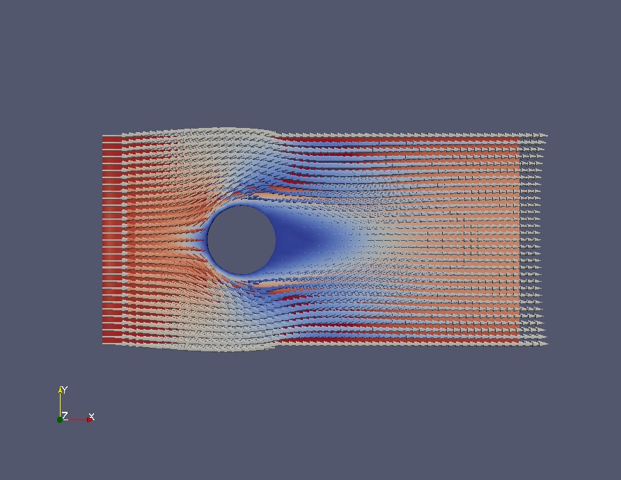

<!-- $theme: default -->

# OpenFOAM tutorial
シリンダー周りの流れを見てみよう

- - - 

- - -

# 計算の規模感

円の直径: 1cm
流速: いろいろ変えてみる
流体: 空気

---

# とりあえず動かしてみる

```sh
cd ~Desktop/openFOAM-tutorial-cylinder/
blockMesh # 長方形ができます
paraFoam # 結果確認
snappyHexMesh # 穴があきます
cp 0.002/polyMesh/* constant/polyMesh/ #メッシュのファイルをコピー
rm -r 0.001 0.002 # 不要なファイルを削除
paraFoam # 結果確認
cp -r 0.org 0 # 初期値設定
pisoFoam > piso.log # 計算実行
```

## ここからいろいろ設定してみよう

- - -

# 描画する間隔や時間の設定

## system/controlDict

```cpp
application     pisoFoam; //ソルバの設定
startFrom       startTime;
startTime       0; // 開始時間の設定(s)
stopAt          endTime;
endTime         15; // 終わりの時間の設定(s)
deltaT          0.001; // 計算間隔の設定(s)
writeControl    timeStep;
writeInterval   1000; // 1000回に一回描画(つまり1回/1sec)
purgeWrite      0;
writeFormat    f ascii;
writePrecision  6;
writeCompression off;
timeFormat      general;
timePrecision   6;
runTimeModifiable true;
functions
{
   #include "forceCoeffs" // シリンダにかかる力の確認用
}
```

- - - 

# 演習1

終わりの時間を2秒に設定し，さらに0.01秒単位で結果を確認できるようにしてみよう

設定し終わったら，
```sh
./cleanCase
pisoFoam > piso.log
```
を実行する

- - -

# 流速の設定
シリンダーにあたる風の速さを設定してみる

- - - 

## 0/U (一部)
ここにある2.0E-2が0.02m/sを表す．

```
internalField   uniform (2.0E-2 0 0);

boundaryField
{
	upstream
	{
		type 		fixedValue;
		value 	uniform (2.0E-2 0 0);
	}
	downstream
	{
		type 			inletOutlet;
		inletValue 	uniform (2.0E-2 0 0);
		value 		$internalField;
	}
	upANDdown
	{
		type 			inletOutlet;
		inletValue 	uniform (2.0E-2 0 0);
		value 		$internalField;
	}
```

- - -

# 演習2 流速を10m/sに設定してみよう

2.0E-2は色んな所にあるが，それはすべて変更する
計算は落ちるはず

```
pisoFoam > piso.log
```

- - -

# 演習3 流速を0.5m/sに設定してみよう

```
pisoFoam > piso.log
```

- - -

# クーラン数(Courant Number)
クーラン数$C$は, 以下の式で求めることができる.
1ステップあたりの時間が経過したときに, 流れの要素いくつ分進むか

$$C = \frac{u \Delta t}{\Delta L}$$

$u$:流速
$\Delta t$:時間間隔
$\Delta L$:要素幅
* クーラン数は, OpenFOAMが勝手に求めてくれる

ref) http://www.cradle.co.jp/tec/column01/017.html 
(visited: 2016-10-19)
- - -

# クーラン数を見てみよう
* `pisoFoam`実行時の標準出力に出てくる.
```bash
cat piso.log | grep -e "Time =" -e Courant | \
grep -v Execution
```
* クーラン数は1未満でなければならない。(格子を飛び越していってしまうため)

- - -

# クーラン数を大きくするということ
$$C = \frac{U \Delta t}{\Delta L} < 1$$
* 細かく計算したいとき...
	meshを細かくする ⇔ $\Delta L$を小さくする ⇔ $C$が大きくなる
* より流速の早い流れ計算したい時...
	$U$が大きくなる ⇔ $C$が大きくなる
### クーラン数が大きくなると
$\Delta t$ を小さくする必要がある ... 計算時間がかかる
meshを細かくしたら計算数も多くなり, より計算時間がかかる

- - - 

# 円にかかる力を見てみる

```
less postProcessing/forces/0/forceCoeffs.dat
```

lessコマンドの使い方
```
hjkl -> 方向キー
q -> 終了
```

gnuplotとかplotlyとかmatplotlibとかseabornとかでプロットしてみよう
たぶんTime=0ででかいCdが出てるので，0を含ませないようにしてあげましょう

---

